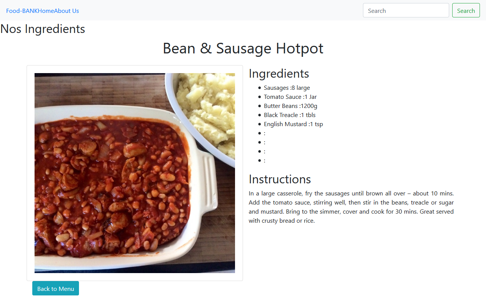

Food-Bank
Foo-Bank is a React web application that retrieves data from 'The Meal DB' API. A visitor can select the food menu by choosing any category from the dropdown and can also view the full details of each meal by clicking on the details. It is built using React/Redux.

## snapshot

## live demo
[Tasty-Menu app](https://spa.d21acy6av6ta0x.amplifyapp.com/)

## Video Presentation
(https://www.loom.com/share/5b69a0b6a38c4e66b3c869f8403a0518)

This project was bootstrapped with [Create React App](https://github.com/facebook/create-react-app).

## Features
- A list of food menu from different countries .
- You can see the categories of the food by filtering them.
- When an item in the menu is clicked, the details will be displayed.
- You can navigate back to the home page by clicking on the button below.

## Potential Features
- Search Form by category.

## Built with
- React
- HTML
- CSS
- JavaScript/ES6
- React Hooks
- React Router
- Redux
- Boostrap
- React Redux
- Meals DB
- Netlify
- AWS Cloud 9
- Amplify (AWS)

### Prerequisites

- Node
- Npm

### Setup

- git clone `https://github.com/Abdoulaye-Thespy/Food-Bank.git`
- cd Food-Bank
- run npm install
- run npm run start

## Author

👤 **Njigouh Abdoulaye Razak**

- Github: [@githubhandle](https://github.com/Abdoulaye-Thespy)
- Twitter: [@twitterhandle](https://twitter.com/AbdoulayeThe)
- Linkedin: [linkedin](https://www.linkedin.com/in/njigouh-abdoulaye-razak/)

## 🤝 Contributing

Contributions, issues and feature requests are welcome!

Feel free to check the [issues page](https://github.com/Abdoulaye-Thespy/Food-Bank/issues).

## Show your support

Give a ⭐️ if you like this project!

## Acknowledgments

- Microverse
- Microverse TSEs

